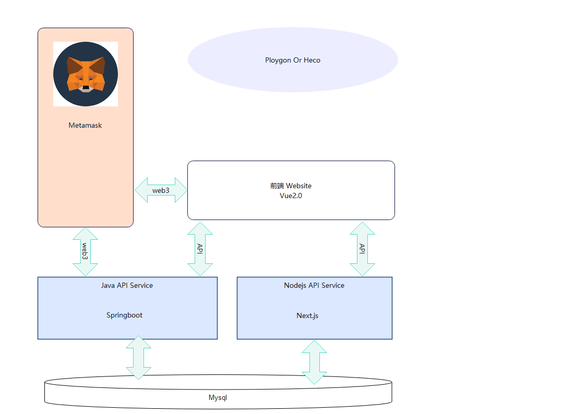

# Website 项目结构

## 工程关系图

> 元宇宙区块链前端涉及4个代码工程

- [Nodejs API](https://github.com/t2p-meta/nodejs-service) ： 提供API接口服务
- [Java API]() ： 提供API接口服务
- [website](https://gitee.com/t2p-meta/meta-officail) ： 网站前端
- [smart contract]() ： 智能合约工程




> Meta-Officail

项目源码位于： https://gitee.com/t2p-meta/meta-officail

## 项目目录结构介绍

- pages [/src/pages] 核心页面vue 源码
- API [src/biz/api/] 前端与Nodejs ，Java API 服务 接口配置文件目录
- components [src/components] 前端页面 Header & Footer 
- layouts 页面布局管理
- lib 公共js 封装库
- meta-ui [src/meta-ui] 框架封装插件： Toast Nav-router 等
- conf 前端打包配置参数管理js


## 前端打包参数配置

配置文件 .env.lcoal

```
VUE_APP_TITLE="The 2nd Planet"
VUE_GCLI_WIN_PREFFIX=''
VUE_APP_ALCHEMY_MUMBAI_APIKEY=
VUE_APP_ALCHEMY_MATIC_APIKEY=
META_API_BASE=
STATIC_BASE=
NODE_API_BASE=https://front.planet2nd.com
#NODE_API_BASE=http://192.168.50.141:3000
# Reworld API 
REWORLD_API_BASE=https://game.planet2nd.com
# 用户注册twitter 认证转推验证官方推特主页
T2P_TWITTER=用户注册twitter 认证转推验证官方推特主页
T2P_YOUTUBER=https://www.youtube.com/channel/UCZNxe_9FQAK2Z3suwaZlwpQ/featured
T2P_FACEBOOK=https://www.facebook.com/profile.php?id=100081954019571
T2P_DISCORD=用户注册Discord认证verify官方discord channel 链接
T2P_EMAIL=页脚官方contact邮箱
# Twitter & Discord 转发地址
PROJECT_DEF_RETWEET=
PROJECT_DEF_DISCORD=https://discord.com/invite/FRjb7KfRKr
# 游戏客户端WINDOW下载链接
CLI_PLAYER_WIN=https://preupdate.planet2nd.com/Planet2ndInstall.exe
CLI_PLAYER_MAC=游戏客户端MAC下载链接
CLI_PLAYER_APK=游戏客户端APK下载链接
CLI_PLAYER_IOS=游戏客户端下载链接IOS
CLI_STUDIO_WIN=编辑器客户端Window下载链接
CLI_STUDIO_MAC=编辑器客户端MAC下载链接
# Metamask 插件下载商店地址
PLUG_METAMASK_CHROME=
PLUG_METAMASK_EDGE=
PLUG_METAMASK_FOX=https://addons.mozilla.org/zh-CN/firefox/addon/ether-metamask/

```

## 前端主要命令

```bash 
npm run build // yarn build  打包正式环境
npm run opt // 优化测试打包
npm run dev // 本地开发启动 

```

- [--prerender] 在production 模式下增加该参数，启用预渲染打包模式，打包成功后文件目录为 dist/vue
- [--report] 开启打包优化分析功能 [--prerender 同时开启，report 无效]

## 游戏地图组件

### 组件目录结构

> metamap 目录说明

──┯───┰─base : 地图组件基础对象功能封装

  │   ┝──── accelerator : 用于优化渲染时缓存状态

  │   ┝──── border-collie : 用户计算边界，越界的算法控制器

  │   ┝──── land-box : 地块基类

  │   ┝──── meta-canvas : 地图基类

  │   ┝──── migration-controller : 地块移动控制器

  │   ┝──── tile : 地块基础事件封装基类

  │   ┝────              
  ┝────dom : DOM 界面drawer 目录 

  ┝──── events : 地图事件管理

  ┝───┰─ shower : ：

  │   ┝──── meta-loader :地图管理类 meta-loader Vue 通过loadLands 加载地块数据到浏览器内存，

  │   ┝────  

  ┝──── utils : 工具类

  ┝──── const.js :  常量定义

  ┝──── settings ： 地图组件默认参数配置

### 地图组件使用Example

```js
const wrapbox = this.$refs.metaBoxWrap  // 地图绘制 DOM 节点 div 内部无元素 
const clickTileHandler = this.clickLandHandler.bind(this) // 点击地块 回调函数，返回地块基础信息，xc,yc 为唯一标识

const metaCanvas = new MetaLoader(wrapbox, {
    canvasClassName: 'meta-vas', // 扩展自定义地图Canvas 样式
    clickTileHandler, 
    moveThrottleWait: 20, // 移动防抖优化参数 毫秒值
    moveDebounceWait: 16.7, // 拖动绘制参数 浏览器渲染优化 建议不要修改，16.7 为Chrome ，Edge 等chromium 内核官方标准推荐
})
// 加载地块数据，渲染绘制可见屏地块元素
metaCanvas.loadLands(landData).renderTiles()

metaCanvas.utils 工具类包
```

### 初始化JSON 工具类

> ci/compress-json.js 用于压缩初始化化json

```bash
node ci/compress-json.js # 生成压缩后的文件放在 public/vendors/data/lands-data.min.js 自动加载到网站全局对象， MetaGame.getLands()
```

## 线上环境打包优化配置

### 提取CDN js 配置文件
> 修改 文件 /ci/conf/build-optimization.js 

> 如果增加CDN js ,需要同时修改 externals 和 buildJs


```js
const externals = {
  vue: 'Vue',
  'vue-router': 'VueRouter',
  'vue-i18n': 'VueI18n',
  vuex: 'Vuex',
  axios: 'axios',
  web3: 'Web3',
  aos: 'AOS',
  echarts: 'echarts',
  // lodash: {
  //   root: '_',
  // },
}
const buildCss = qn
  ? [
      '//fonts.loli.net/css?family=Roboto:100,300,400,500,700,900',
      '//cdn.bootcdn.net/ajax/libs/aos/2.3.4/aos.css',
    ]
  : [
      '//fonts.googleapis.com/css?family=Roboto:100,300,400,500,700,900',
      // '//cdn.jsdelivr.net/npm/@mdi/font@latest/css/materialdesignicons.min.css',
      '//cdn.bootcdn.net/ajax/libs/aos/2.3.4/aos.css',
    ]

const buildJs = qn
  ? [
      // '//cdn.bootcdn.net/ajax/libs/lodash.js/4.17.21/lodash.min.js',
      '//cdn.bootcdn.net/ajax/libs/aos/2.3.4/aos.js',
      '//cdn.bootcdn.net/ajax/libs/vue/2.6.14/vue.min.js',
      '//cdn.bootcdn.net/ajax/libs/web3/1.5.0/web3.min.js',
      '//cdn.bootcdn.net/ajax/libs/vue-router/3.5.1/vue-router.min.js',
      '//cdn.bootcdn.net/ajax/libs/vue-i18n/8.26.3/vue-i18n.min.js',
      '//cdn.bootcdn.net/ajax/libs/vuex/3.6.2/vuex.min.js',
      '//cdn.bootcdn.net/ajax/libs/axios/0.26.1/axios.min.js',
      '//cdn.bootcdn.net/ajax/libs/echarts/5.3.2/echarts.simple.min.js',
    ]
  : [
      // '//cdn.bootcdn.net/ajax/libs/lodash.js/4.17.21/lodash.min.js',
      '//cdn.bootcdn.net/ajax/libs/aos/2.3.4/aos.js',
      '//cdnjs.cloudflare.com/ajax/libs/vue/2.6.14/vue.min.js',
      '//cdn.bootcdn.net/ajax/libs/web3/1.5.0/web3.min.js',
      '//cdnjs.cloudflare.com/ajax/libs/vue-router/3.5.1/vue-router.min.js',
      '//cdnjs.cloudflare.com/ajax/libs/vue-i18n/8.26.3/vue-i18n.min.js',
      '//cdnjs.cloudflare.com/ajax/libs/vuex/3.6.2/vuex.min.js',
      '//cdnjs.cloudflare.com/ajax/libs/axios/0.26.1/axios.min.js',
      '//cdn.bootcdn.net/ajax/libs/echarts/5.3.2/echarts.simple.min.js',
    ]


```

## 项目 UI 层介绍

> 项目集成Vuetify UI ,其中按钮组件 form 部分组件基于Vuetify 2.x 组件开发，组件API 文档参见

https://vuetifyjs.com/zh-Hans/getting-started/installation/

> UI 动态效果使用 wowjs & AOS [此部分为赵老师引入，功能使用参见其官方文档]

### 项目封装组件

- Toast 【位于：src\meta-ui\toast 】 全局弹出提示： $.toast('','fail')
- 右上角钱包登录封装 【位于：src\meta-ui\connector】
- 页面中所有带圆尖头图标的跳转链接封装 【位于：src\meta-ui\navigator】 <Meta-router path="xxx" text="xxx" />
- 基于Opensea标准的元宇宙NFT traits 选择器封装 【】，使用方式 <MetaTraitsEditor category="" />

```vue
      <MetaTraitsEditor
        ref="MetaTraitEditor"
        title="Add Opensea Traits"
        :category="categoryName"
        :customized="0"
        @traitsChanged="metaTraitsChanged"
      />
```

### 前端缓存管理源码

> 前端采用Vuex 缓存页面接口数据： src/store

> 其中 merge-actions.js，core-mutations.js,core-geeters 合并自较新版本fingerchar 2022.04.19 更新版本

> meta-actions 在fingerchar 基础上封装方法

> 其余模块代码[ui/nftcard/pocket/biz/user]根据业务独立开发，与fingerchar 无关联


### 前端区块链网络配置

- src\settings.js 

```js
const PLOYGON_MUMBAI = {
  channelId: 80001,
  name: 'Mumbai',
  coinSymbol: 'MATIC',
  symbol: 'MATIC',
  default: false,
  rpc: 'https://rpc-mumbai.matic.today',
  rpcUrls: [
    'https://matic-mumbai.chainstacklabs.com',
    'https://rpc-mumbai.matic.today',
  ],
  privateRpc: process.env.VUE_APP_ALCHEMY_MUMBAI_APIKEY
    ? `https://polygon-mumbai.g.alchemy.com/v2/${process.env.VUE_APP_ALCHEMY_MUMBAI_APIKEY}`
    : '',
  blockExplorerUrls: ['https://mumbai.polygonscan.com/'],
  hasBlindbox: true,
  hasAuction: true,
  opensea: 'https://testnets.opensea.io/assets/mumbai/',
  eip1559: false,
}

//https://polygon-mainnet.g.alchemy.com/v2/
const PLOYGON_MAINNET = {
  channelId: 137,
  name: 'Polygon Mainnet',
  coinSymbol: 'MATIC',
  symbol: 'MATIC',
  default: false,
  rpc: 'https://rpc-mainnet.matic.network',
  rpcUrls: [
    'https://matic-mainnet.chainstacklabs.com',
    'https://rpc-mainnet.maticvigil.com',
    'https://rpc-mainnet.matic.quiknode.pro',
    'https://matic-mainnet-full-rpc.bwarelabs.com',
  ],
  privateRpc: process.env.VUE_APP_ALCHEMY_MATIC_APIKEY
    ? `/https://polygon-mainnet.g.alchemy.com/v2/${process.env.VUE_APP_ALCHEMY_MATIC_APIKEY}`
    : '',
  blockExplorerUrls: ['https://polygonscan.com/'],
  hasBlindbox: true,
  hasAuction: true,
  opensea: 'https://testnets.opensea.io/assets/mumbai/',
  eip1559: false,
}

module.exports = {
  pageLimit: 20,
  deploy: true,
  name: 'SAME NFT',
  url: 'https://planet2nd.com',
  signMessage:
    "Welcome Login Planet2nd Market. This is completely secure and doesn't cost anything!",
  decimal: 8,
  networks: [
    {
      channelId: 4,
      name: 'Ropsten Testnet',
      coinSymbol: 'ETH',
      symbol: 'ETH',
      default: false,
      rpc: 'https://rinkeby.infura.io/v3/9aa3d95b3bc440fa88ea12eaa4456161',
      hasBlindbox: true,
      hasAuction: true,
      opensea: '',
      eip1559: false,
    },
    {
      ...PLOYGON_MAINNET,
      default: false,
    },
    {
      ...PLOYGON_MUMBAI,
      default: true,
    },
    {
      channelId: 8899,
      name: 'Local',
      coinSymbol: 'ETH',
      symbol: 'ETH',
      default: false,
      rpc: 'http://192.168.50.141:8545/',
      hasBlindbox: true,
      hasAuction: true,
      opensea: 'https://testnets.opensea.io/assets/mumbai/',
      eip1559: false,
    },
  ],
  share: {
    twitter: 'https://mobile.twitter.com',
    telegram: 'https://t.me',
    email: '2ndP@csdn.net',
    youtube: 'https://youtube.com/channel',
  },
}

```

## Opensea Traits 选择器 

> 代码目录 src\meta-ui\opensea

### 新增业务分类

- 1. 新建业务分类对应traits 文件 xxx-traits.js 
```js 
export const XXXX_TRAIT_STATE = {
  traitType: COORDINATE_TRAIT_KEY, // 对应opensea 的trait_type
  value: '', // opensea value 
  displayType: NONE_TRIAIT_DISTYPE, // 对应Opensea 的disolay_type 属性值
  sort: 8, // 显示顺序
  required: false, // 是否必填
  validation: function valid(v) {  //trait 输入值 校验函数
    return !/^(-)?([\d]+),(-)?([\d]+)$/.test(v) && this.required
      ? `${COORDINATE_TRAIT_KEY} rquired the land [xc,yc].`
      : ''
  },
  descI18n: 'opensea.traits.coordinate', 
  desc: `Please entry the land coordinate like 102,15`,  // Traits 描述 ，提供给用户填写提示的UI显示
  readonly: false,  // 定义为只读时，UI 不允许修改
  categories: [CATEGORY_ITEM_LAND, CATEGORY_ITEM_PASSPORT],  // 所属category 用于根据分类过滤 不同traits
}
```

- 2. 修改categories 增加业务类型
- 3. 修改 src\meta-ui\opensea\traits-handler.js 将新增traits数组增加到ALL_TRAITS_ITEMS
- 4. 页面UI 调用

```vue
<MetaTraitsEditor
  ref="MetaTraitEditor"
  title="Add Opensea Traits"
  :category="categoryName"
  :customized="0"
  @traitsChanged="metaTraitsChanged"
/>
```

### Opensea Traits 工具类

- filterTraitByCategory 根据category 过滤对应的traits
- getMetaJson 获取 页面填写的traits 数组，去重后的
- mergeKVTraits ： 合并traits ，同时去重，参数为 key/value 形式 ，如 {postcode: 'N1K B0J'}

```js
  const PostcodeKey = 'Postcode'
  const ParcelsKey = 'Parcel'
  const CoordinateKey = 'Coordinate'

  let postcode = coordinateStringify(xc, yc)
    ? coordinateStringify(xc, yc)
    : ''

  const traitMap = {
    [CoordinateKey]: `${xc},${yc}`,
    [ParcelsKey]: parcel,
    [PostcodeKey]: postcode,
  }

  return mergeKVTraits(traits, traitMap)
```

- mergeTraits： :合并traits ,同时去重，参数为 数组

## 游戏唤起按钮

- 文件目录 ：src\meta-ui\wakeup
- 核心文件： src\meta-ui\wakeup\play-button.vue

### 默认 游戏唤起url 前缀

> https://game.planet2nd.com/iplayer/download?mapId

打包配置： .env.Local
WAKEUP_IFRAME_URL=https://game.planet2nd.com/iplayer/download

### 使用方式

> mapid : 游戏id 必传

```vue
<PlayBtn
  text="Play Game"
  mapid="211665193871082031"
  mapname="小岛"
  :ignorePassport="true" 
  arrow 
></PlayBtn>

<PlayBtn
      text="Play Game"
      mapid="211665193871082031"
      mapname="小岛"
      ignorePassport //控制是否校验 Passport 
      arrow // 隐藏 箭头按钮
></PlayBtn>
<!-- 
:ignorePassport="true" 控制是否校验 Passport 
 arrow /*隐藏 箭头按钮*/
-->       


```

### Iframe 内部主动通知parent弹出窗口关闭

```js
parent.postMessage("closePlayerPopup","*");  // closePlayerPopup 与 play-button.vue 中handlePostMessage 判断对应
```